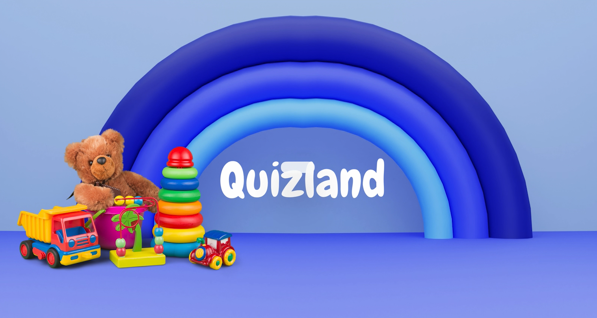
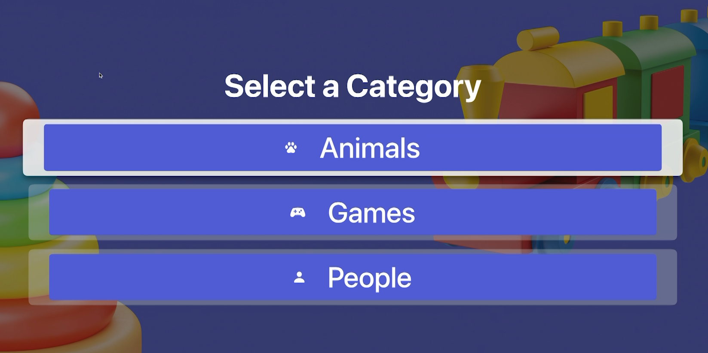
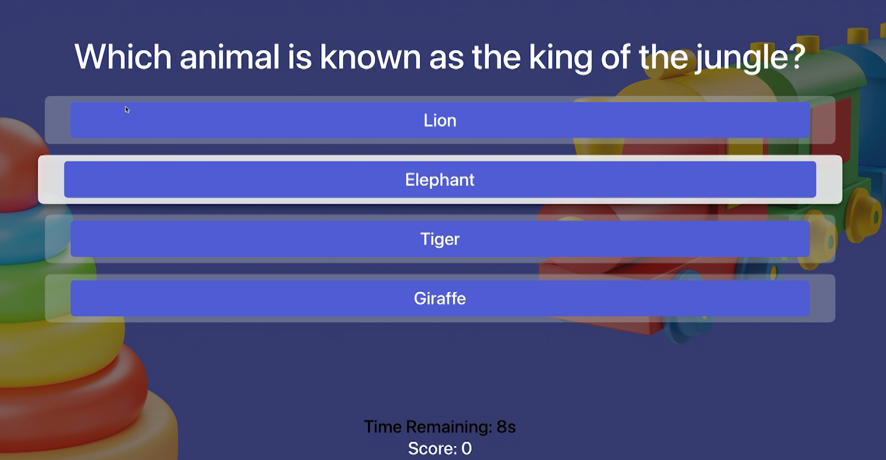
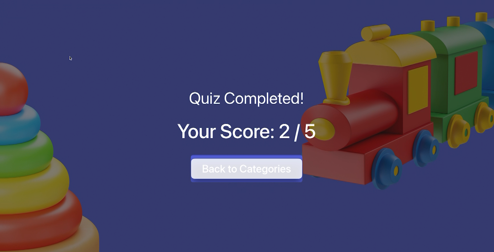

# Quizland 🎮

### An engaging quiz app for kids, built for the tvOS platform using **Swift** and **Xcode**.

---

## Description  
**Quizland** is a fun and interactive quiz application tailored for kids. It features:  
- A splash screen upon launch.  
- A category selection screen with multiple quiz topics.  
- Timed questions to encourage quick thinking.  
- Score tracking for a playful yet educational experience.  

---

## Users  
- **Kids:** Enjoy interactive learning through engaging quizzes.  
- **Parents:** Monitor their child’s progress and ensure suitable content.

---

## Unique Features  
- Kid-friendly and intuitive interface.  
- Timed quizzes to improve focus and decision-making.  
- Optimized for Apple TV remote and large-screen interaction.  

---

## Screenshots  

---

## Key Technical Details  
- **Framework:** SwiftUI  
- **Platform:** tvOS  
- **Development Environment:** Xcode  
- **Navigation:** `NavigationStack` and `NavigationLink` for smooth transitions.  

---

## Future Enhancements  
- **Multiplayer Mode:** Allow players to compete in real-time.  
- **Question Bank Expansion:** Let users add custom quizzes.  
- **Leaderboards:** Track scores and inspire friendly competition.  

---

## Commercial Potential  
- **In-App Purchases:** Offer premium quizzes and features.  
- **Ad Revenue:** Include non-intrusive ads during transitions.  
- **Subscription Model:** Unlock exclusive educational content.  

---

## Challenges  
- Designing a user-friendly interface for Apple TV remote.  
- Managing seamless transitions between timed questions.  
- Testing the app thoroughly across tvOS devices.

---

**Let’s make learning fun with Quizland!**
